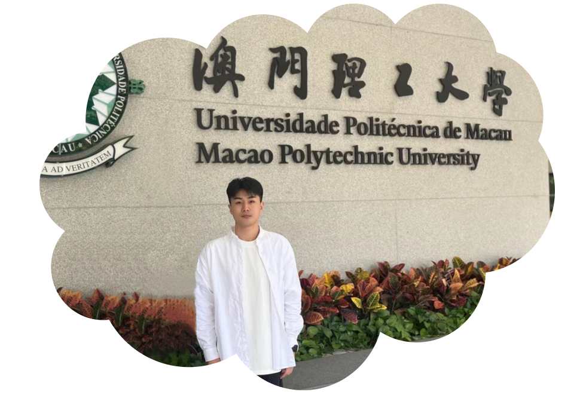

> [!IMPORTANT]
> 
> **我正在寻求一个PhD.的就读机会，如果您对我有兴趣可以发邮件给我: <a href = "mailto: wrs6@88.com">wrs6@88.com</a>**
> > I am seeking a PhD. opportunity, if you are interested you can email me: wrs6@88.com

<!--
> [!IMPORTANT]
> 
> Welcome to join [🥝QiyiGuo Research Group](https://papaya-gumdrop-233639.netlify.app/), We are dedicated to building safe, reliable, and practical visual and language AI models to serve society.
-->

<!--p align="center">
  

&nbsp;&nbsp;&nbsp; &nbsp;&nbsp;&nbsp;

</p-->
  <h3 align="center">王荣胜｜Rongsheng Wang  </h3>
 <!-- <h5 align="center">💻做一切看起来都不那么容易实现的事情🎨</h5> -->
  <!--h5 align="center">💻Doing everything🎨 that seems not so easy to achieve!</h5-->
  <!--I'm Rongsheng Wang, a master of Macao Polytechnic University. Welcome to join <a href="https://github.com/Turbo-AGI">Turbo-AGI Research Group</a>, We are dedicated to building safe, reliable, and practical visual and language AI models to serve society. We also own a company which you can learn about by visiting <a href="https://github.com/QiYuan-tech">Qiyuan.Tech</a>.-->

<!--  -->
<!--a href="https://www.zhihu.com/people/wang-rong-sheng-74"></a-->

<!--a href="https://twitter.com/RongshengWang"></a-->

  
  
  
  
  
  

<!-- 

&nbsp;&nbsp;&nbsp; &nbsp;&nbsp;&nbsp;

&nbsp;&nbsp;&nbsp; &nbsp;&nbsp;&nbsp;

&nbsp;&nbsp;&nbsp; &nbsp;&nbsp;&nbsp;

&nbsp;&nbsp;&nbsp; &nbsp;&nbsp;&nbsp;

&nbsp;&nbsp;&nbsp; &nbsp;&nbsp;&nbsp;

&nbsp;&nbsp;&nbsp; &nbsp;&nbsp;&nbsp;

-->

  <!--  -->
  
<!--img src="https://github-readme-stats.vercel.app/api?username=wangrongsheng&count_private=true&show_icons=true&hide_border=true&bg_color=25,050A27,4A54BC&title_color=ffffff&text_color=cccccc&icon_color=4A54BC&border_radius=5" /-->

<!--p align = "center">
  
</p-->

<!--
&nbsp;

  

-->

<!--
|Core Projects|Contribute|
|:-:|:-:|
|||
-->

<table>
<tr>
  <td> 
     
  </td>
  <td>
         
  </td>
</tr>
  <tr>
  <td> 
     
  </td>
  <td>
         
  </td>
</tr>
  <tr>
  <td> 
     
  </td>
    <td> 
     
  </td>
</tr>
  <tr>
  <td> 
     
  </td>
    <td> 
     
  </td>
</tr>
  </tr>
  <tr>
  <td> 
     
  </td>
    <td> 
     
  </td>
</tr>
</table>
